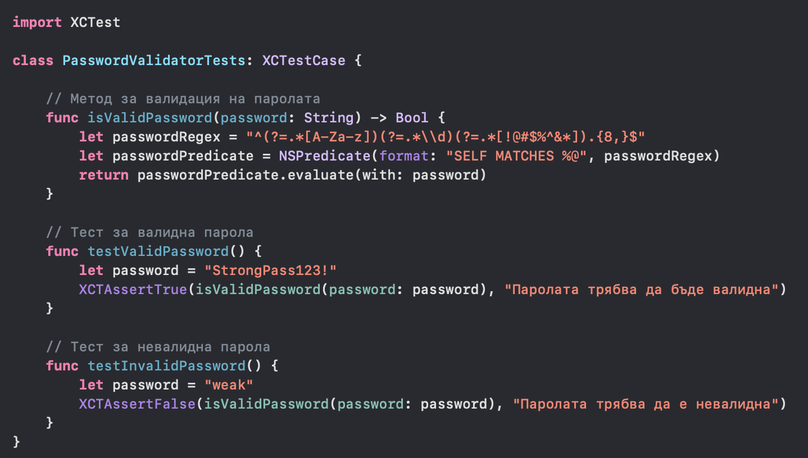
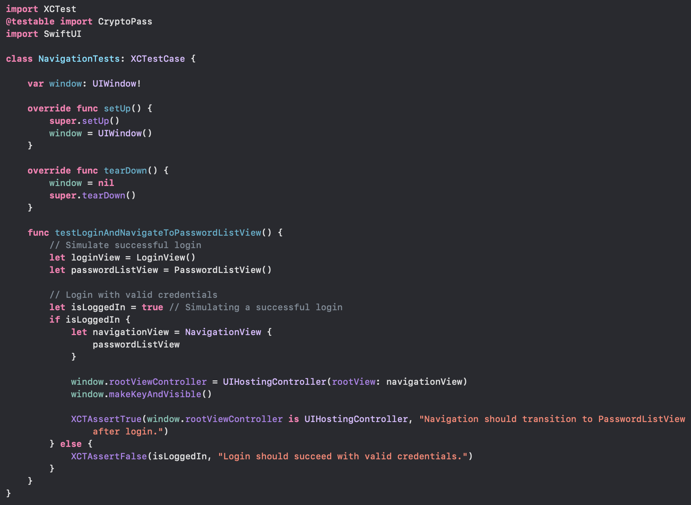
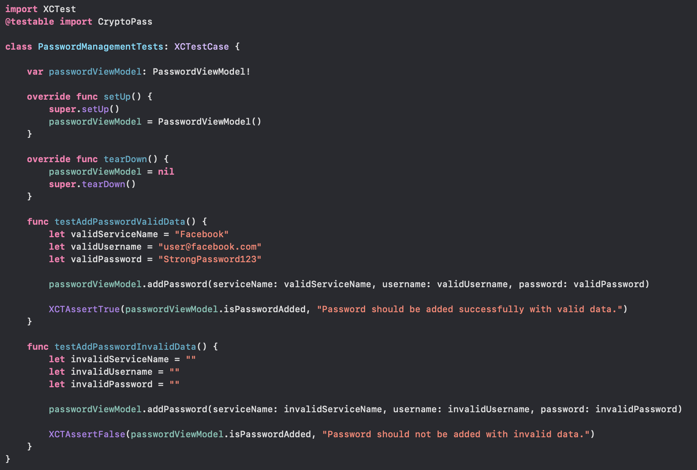

# CryptoPassApp

CryptoPassApp is a SwiftUI password manager project for Apple platforms, focused on secure password storage workflows, biometric authentication, Core Data persistence, and a clean public project structure for portfolio presentation.

### Features :
- [x] Login and registration flow
- [x] Password list and detail views
- [x] Add password workflow
- [x] Core Data storage
- [x] Encryption services
- [x] Biometric authentication hooks
- [x] Firebase integration layer
- [x] Unit tests
- [x] UI tests

# Quick View
#### Login + Authentication
The project includes SwiftUI screens for login, registration, authentication state handling, and biometric unlock entry points.

#### Password Management
The visible source includes password listing, detail presentation, add-password flows, and model-backed storage structure.

#### Settings
The project includes settings-related UI and configuration-oriented user flows.

#### Profile
User profile management and password-related account flows are represented in the app structure.

# Project Structure
- `CryptoPass/` contains the SwiftUI app source, models, services, view models, views, and assets.
- `CryptoPassTests/` contains unit tests.
- `CryptoPassUITests/` contains UI test targets.
- `CryptoPass.xcodeproj/` contains the Xcode project and Swift Package Manager configuration.

# Local setup
1. Open `CryptoPass.xcodeproj` in Xcode.
2. Resolve Swift Package dependencies.
3. Copy `CryptoPass/GoogleService-Info.example.plist` to `CryptoPass/GoogleService-Info.plist`.
4. Replace the placeholder Firebase values with your own configuration.
5. Select the `CryptoPass` scheme and build from Xcode.

# Notes
- The real `GoogleService-Info.plist` is intentionally excluded from the public repository.
- A sample config file is included as `CryptoPass/GoogleService-Info.example.plist`.
- The repository is presented as a public-safe source snapshot of the project.
- Some additional cleanup may still be useful around older project artifacts and Xcode metadata.

# License
This project is licensed under the MIT License. See the `LICENSE` file for details.
